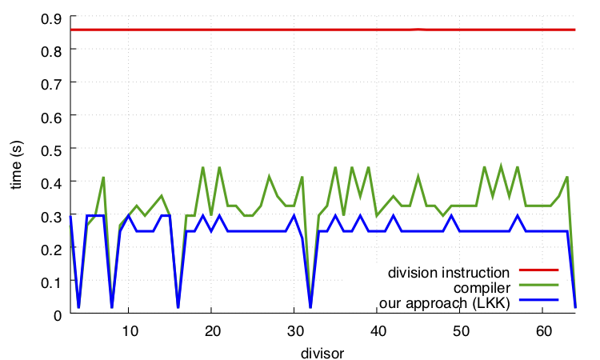

# fastmod
[](https://github.com/lemire/fastmod/actions/workflows/ubuntu22.yml)
[](https://github.com/lemire/fastmod/actions/workflows/vs17.yml)

A header file for fast 32-bit division remainders  on 64-bit hardware.

How fast? Faster than your compiler can do it!

Compilers cleverly replace divisions by multiplications and shifts, if the divisor is known at compile time. In a hashing benchmark, our simple C code can beat  state-of-the-art compilers (e.g., LLVM clang, GNU GCC) on a recent Intel processor (Skylake).



Further reading:

- [Faster Remainder by Direct Computation: Applications to Compilers and Software Libraries](https://arxiv.org/abs/1902.01961), Software: Practice and Experience  49 (6), 2019.


##  Usage

We support all major compilers (LLVM's clang, GNU GCC, Visual Studio). 

It is a header-only library but we have unit tests. Assuming a Linux/macOS setting:

```
make
./unit
```

The tests are exhaustive and take some time.

You can also build the tests using cmake which will work nearly everywhere (including under Windows).

```
cmake -B build 
```

To enable the exhaustive tests, do...

```
cmake -B build -D FASTMOD_EXHAUSTIVE_TESTS=ON
```

Under Windows, you can run tests as follows:

```
cmake --build build --config Release
cd build
ctest . --config Release
```

Users of Visual Studio need to compile to a 64-bit binary, typically by selecting x64 or ARM64 in the build settings. Visual Studio should default on 64-bit builds on 64-bit systems.


##  Code samples

In C, you can use the header as follows.

```C
#include "fastmod.h"

// unsigned...

uint32_t d = ... ; // divisor, should be non-zero
uint64_t M = computeM_u32(d); // do once

fastmod_u32(a,M,d);// is a % d for all 32-bit unsigned values a.

fastdiv_u32(a,M);// is a / d for all 32-bit unsigned values a, d>1.


is_divisible(a,M);// tells you if a is divisible by d

// signed...

int32_t d = ... ; // should be non-zero and between [-2147483647,2147483647]
int32_t positive_d = d < 0 ? -d : d; // absolute value
uint64_t M = computeM_s32(d); // do once

fastmod_s32(a,M,positive_d);// is a % d for all 32-bit a

fastdiv_s32(a,M,d);// is a / d for all 32-bit a,  d must not be one of -1, 1, or -2147483648

```

In C++, it is much the same except that every function is in the `fastmod` namespace so you need to prefix the calls with `fastmod::` (e.g., `fastmod::is_divisible`).


## Go version

* There is a Go version of this library: https://github.com/bmkessler/fastdiv


### (Speculative work) 64-bit benchmark

It is an open problem to derive 64-bit divisions that are faster than what the compiler can produce for constant divisors.
For comparisons to native `%` and `/` operations, as well as bitmasks, we have provided a benchmark with 64-bit div/mod. You can compile these benchmarks with `make benchmark`.
These require C++11. It is not currently supported under Visual Studio.

