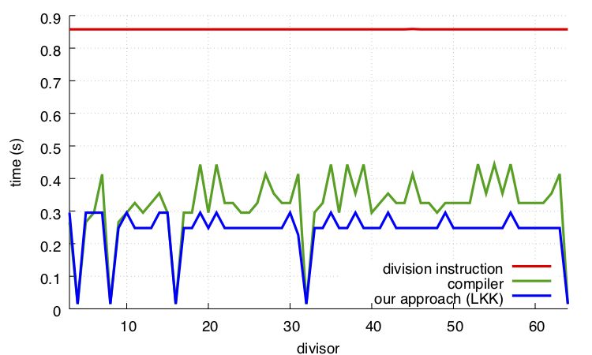

# fastmod

[](https://github.com/lemire/fastmod/actions/workflows/ci.yml)
[](https://opensource.org/licenses/Apache-2.0)

A header-only library for fast 32-bit division and remainder operations on 64-bit hardware.

This library provides optimized implementations that can outperform compiler-generated code for constant divisors, making it ideal for performance-critical applications like hashing algorithms.

## Table of Contents

- [Features](#features)
- [Installation](#installation)
- [Usage](#usage)
- [API Reference](#api-reference)
- [Building and Testing](#building-and-testing)
- [Benchmarks](#benchmarks)
- [Contributing](#contributing)
- [License](#license)
- [Further Reading](#further-reading)

## Features

- **Fast Operations**: Faster than compiler-optimized divisions for known divisors.
- **Header-Only**: Easy to integrate into existing projects.
- **Cross-Platform**: Supports major compilers (Clang, GCC, Visual Studio).
- **Comprehensive Tests**: Exhaustive unit tests ensure correctness.
- **C and C++ Support**: Works in both languages with appropriate namespaces.

## Installation

Clone the repository and include `include/fastmod.h` in your project.

```bash
git clone https://github.com/lemire/fastmod.git
```

Since it's header-only, no additional installation steps are required.

## Usage

Include the header in your C or C++ file:

```c
#include "fastmod.h"
```

For C++, use the `fastmod` namespace:

```cpp
#include "fastmod.h"

// Use fastmod::function_name
```

## API Reference

### Unsigned Operations

- `uint64_t computeM_u32(uint32_t d)`: Compute the multiplier for divisor `d` (do once per divisor).
- `uint32_t fastmod_u32(uint64_t a, uint64_t M, uint32_t d)`: Compute `a % d`.
- `uint32_t fastdiv_u32(uint64_t a, uint64_t M)`: Compute `a / d` (requires `d > 1`).
- `bool is_divisible(uint64_t a, uint64_t M)`: Check if `a` is divisible by `d`.

### Signed Operations

- `uint64_t computeM_s32(int32_t d)`: Compute the multiplier for divisor `d` (use absolute value for `d`).
- `int32_t fastmod_s32(int64_t a, uint64_t M, int32_t positive_d)`: Compute `a % d`.
- `int32_t fastdiv_s32(int64_t a, uint64_t M, int32_t d)`: Compute `a / d` (avoid `d` in `{-1, 1, INT32_MIN}`).

### Example

```c
#include "fastmod.h"

// Unsigned example
uint32_t d = 7;
uint64_t M = computeM_u32(d);
uint32_t result = fastmod_u32(100, M, d); // 100 % 7

// Signed example
int32_t sd = -5;
int32_t pos_d = sd < 0 ? -sd : sd;
uint64_t SM = computeM_s32(sd);
int32_t sresult = fastmod_s32(-100, SM, pos_d); // -100 % -5
```

## Building and Testing

### Prerequisites

- C++11 compatible compiler
- CMake (for cross-platform builds)
- Make (for Unix-like systems)

### Build with Make (Linux/macOS)

```bash
make
./unit
```

### Build with CMake

```bash
cmake -B build
cmake --build build
ctest --test-dir build --output-on-failure
```

For exhaustive tests:

```bash
cmake -B build -DFASTMOD_EXHAUSTIVE_TESTS=ON
cmake --build build
ctest --test-dir build --output-on-failure
```

### Windows (Visual Studio)

Ensure you're building for 64-bit (x64 or ARM64).

```bash
cmake -B build
cmake --build build --config Release
ctest --test-dir build --output-on-failure -C Release
```

## Benchmarks

In hashing benchmarks on Intel Skylake with Clang, this library outperforms compiler optimizations.



For 64-bit operations (experimental):

```bash
make benchmark
```

Requires C++11, not supported on Visual Studio.

## Contributing

Contributions are welcome! Please:

1. Fork the repository
2. Create a feature branch
3. Add tests for new functionality
4. Ensure all tests pass
5. Submit a pull request

## License

This project is licensed under the Apache License 2.0 - see the [LICENSE](LICENSE) file for details.

## Further Reading

- [Faster Remainder by Direct Computation: Applications to Compilers and Software Libraries](https://arxiv.org/abs/1902.01961), Software: Practice and Experience 49 (6), 2019.

### Related Projects

- Go version: [fastdiv](https://github.com/bmkessler/fastdiv)
